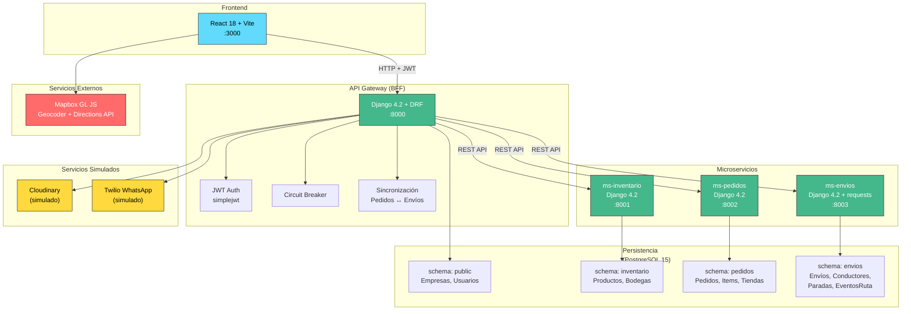

# Diagrama de Arquitectura - SmartLogix

```mermaid
graph TB
    subgraph "Frontend"
        FRONT["React 18 + Vite<br/>:3000"]
    end

    subgraph "API Gateway (BFF)"
        BFF["Django 4.2 + DRF<br/>:8000"]
        JWT["JWT Auth<br/>simplejwt"]
        CB["Circuit Breaker"]
        SYNC["Sincronización<br/>Pedidos ↔ Envíos"]
    end

    subgraph "Microservicios"
        INV["ms-inventario<br/>Django 4.2<br/>:8001"]
        PED["ms-pedidos<br/>Django 4.2<br/>:8002"]
        ENV["ms-envios<br/>Django 4.2 + requests<br/>:8003"]
    end

    subgraph "Persistencia <br/>(PostgreSQL 15)"
        DB_PUBLIC["schema: public<br/>Empresas, Usuarios"]
        DB_INV["schema: inventario<br/>Productos, Bodegas"]
        DB_PED["schema: pedidos<br/>Pedidos, Items, Tiendas"]
        DB_ENV["schema: envios<br/>Envíos, Conductores,<br/>Paradas, EventosRuta"]
    end

    subgraph "Servicios Externos"
        MAPBOX["Mapbox GL JS<br/>Geocoder + Directions API"]
    end

    subgraph "Servicios Simulados"
        CLOUD["Cloudinary<br/>(simulado)"]
        TWILIO["Twilio WhatsApp<br/>(simulado)"]
    end

    FRONT -->|"HTTP + JWT"| BFF
    BFF --> JWT
    BFF --> CB
    BFF --> SYNC
    BFF -->|"REST API"| INV
    BFF -->|"REST API"| PED
    BFF -->|"REST API"| ENV
    INV --> DB_INV
    PED --> DB_PED
    ENV --> DB_ENV
    BFF --> DB_PUBLIC
    FRONT --> MAPBOX
    BFF --> CLOUD
    BFF --> TWILIO

    style FRONT fill:#61dafb,stroke:#333,color:#000
    style BFF fill:#44b78b,stroke:#333,color:#fff
    style INV fill:#44b78b,stroke:#333,color:#fff
    style PED fill:#44b78b,stroke:#333,color:#fff
    style ENV fill:#44b78b,stroke:#333,color:#fff
    style MAPBOX fill:#ff6b6b,stroke:#333,color:#fff
    style CLOUD fill:#ffd93d,stroke:#333,color:#000
    style TWILIO fill:#ffd93d,stroke:#333,color:#000
```
